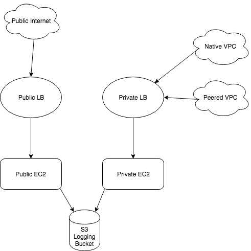

# Wttr.in API sample project
This project will create a public and private AWS stack for the purpose of serving the wttr.in API.

## Project Overview
The project constraints are below:

* The public and private services must be fronted by a load balancer
* There should be at least one stack that is publicly available
* There should be at least one stack that is only privately accessible
* For the private instance, it should be accessible by any client in a single peered VPC under the same AWS account
* Loadbalancer logs should be kept in S3
* Access to the public instance should be restricted to the United States only.
* The wttr.in API may be generated and accessed on the host using any method you prefer
* Write and implement at least one terraform module as part of this process.

### Architecture Design

Two independent stacks were used in order to meet the above requirements as written. A diagram is shown below.



#### Notes
If recommending how to simplify the architecture, and assuming the wttr.in API would be deployed without modification, I would make the following changes:
* Use a single EC2 instance (or group of instances for redundancy) to run the API
* Keep both Public and Private LBs, but point them to the same instance group
* This keeps the backend instances the same, but gives the control for how the endpoints are accessed as requested. Also reduces security groups/rules, and prevents API configuration drift.

## Creating the API stack

### Requirements
Please note, this project was created and tested on MacOS. There may be modifications required for other OSes.

* Access to an AWS account with permissions to create ec2, elb, security groups, s3, waf
    * Create or use an existing access key and secret from the AWS account - https://docs.aws.amazon.com/IAM/latest/UserGuide/id_credentials_access-keys.html#Using_CreateAccessKey
    * Create or use an existing access key pair for ssh access in AWS - https://docs.aws.amazon.com/AWSEC2/latest/UserGuide/ec2-key-pairs.html#having-ec2-create-your-key-pair
    * Place the .pem file for the key pair in the `secrets` directory of this project
* Install Terraform - https://www.terraform.io/intro/getting-started/install.html
    * Ensure the Terraform executable is in your local path
* A forecast.io API key - www.forecast.io (register for an API account and a key is provided)

### Setup
1. Clone this repository to your local machine

```
git clone <url>
```

2. Use the AWS access key and secret you obtained in the Requirements section to create two environment variables on your machine that Terraform can read from.

```
export AWS_ACCESS_KEY_ID=<key_id>
export AWS_SECRET_ACCESS_KEY=<access_key>
```

3. Ensure your .pem file for the AWS access key pair is in the `secrets` directory

4. Edit the `terraform/dev/terraform.tfvars` file to use information from your AWS environment, and desired application names and settings.

5. Edit the `terraform/dev/wttr-setup.sh` script to insert your forecast.io API key

### Build the stack

The project was built with the goal of defining different environments for more efficient code re-use. Only the development environment is configured for now.

From the project's base directory:

```
cd terraform/dev
```

First, initialize the terraform project:

```
terraform init
```

To preview what will be built:

```
terraform plan
```

To build:

```
terraform apply
```

During the run, you will see these outputs:

1. Terraform will output what it plans to build or change
2. It will ask you for confirmation, answer `yes`
3. Terraform will create the stack
4. Once it is created, Terraform outputs some details about what it built (EC2 and LB IPs, DNS, etc)

Once this shows successful completion, your stack is built!

### Destroy the stack
Now that we're done with the project, you will want to clean this up to prevent further billing from AWS.

From the project's base directory, execute the following commands.

```
cd terraform/dev
terraform destroy
```

Terraform will show you what it plans to destroy. If this looks correct, type `yes`.

## Notes
This project was setup with the following in mind.

### Terraform
* All Terraform code is in the `terraform` directory
* It is configured to use modules, which can help in code re-use when building multiple of the same resource (instances)
* This can be expanded to multiple environments with slightly differing configs by copying the `dev` directory to `stage` or `prod` and modifying the `terraform.tfvars` file
* Terraform will not be able to destroy the S3 bucket since it has content, so you must empty the bucket first or manually delete it.

### wttr.in
* I'm cloning from a fork in my own forked repo, due to an issue with the bin/srv.py using an older module
* The remote-exec provisioner isn't working correctly at this point, and only partially running the script. Ran out of time to troubleshoot, but script executes and runs fine once you ssh in
* It's a scripted install based on manual commands for now due to time constraints. Ideally configuration management, a properly designed install script, or docker container would replace this.
* Did not have the time to try all the weather APIs to find one with language-friendly lookup, used default GPS coordinate provider

### Future plans
If I continue work on this sample project, I would
* Use the docker container for wttr.in that I created as a different project
    * https://github.com/ericharris/wttrin-dockerized
* Continue to use data lookups to reduce necessary variables in terraform.tfvars
* Use the openweathermap.org API like in my dockerized wttr project
